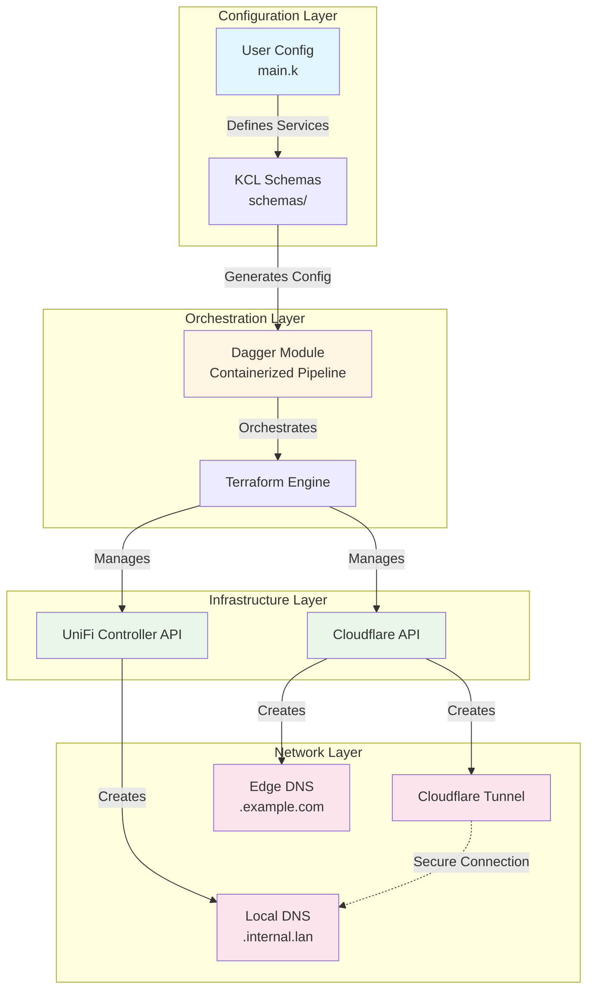
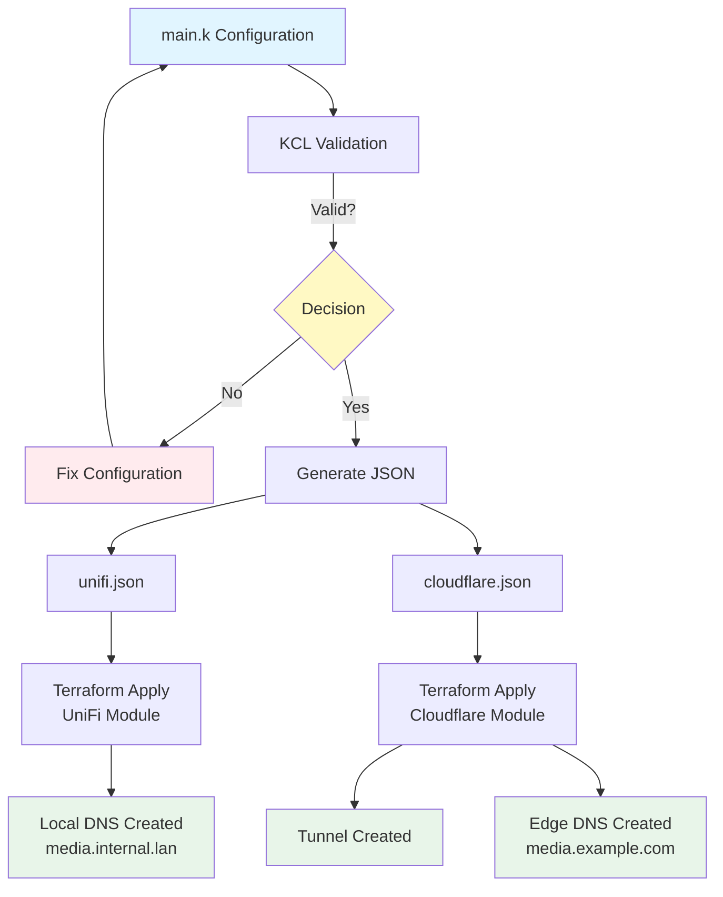
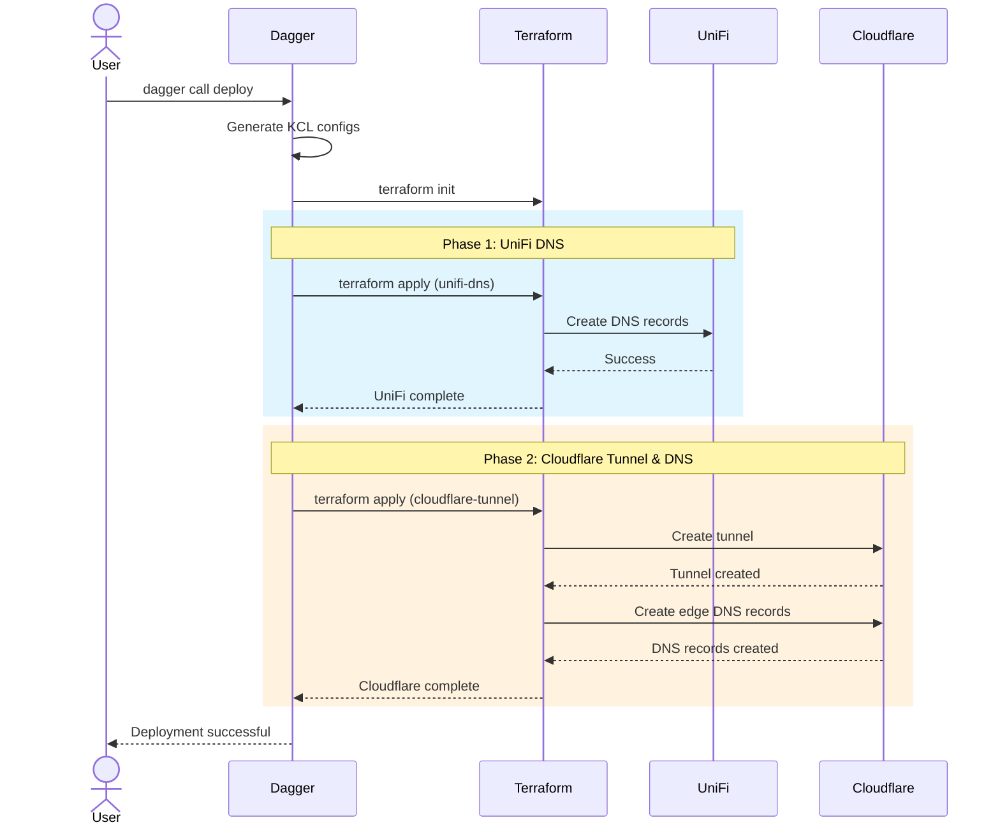
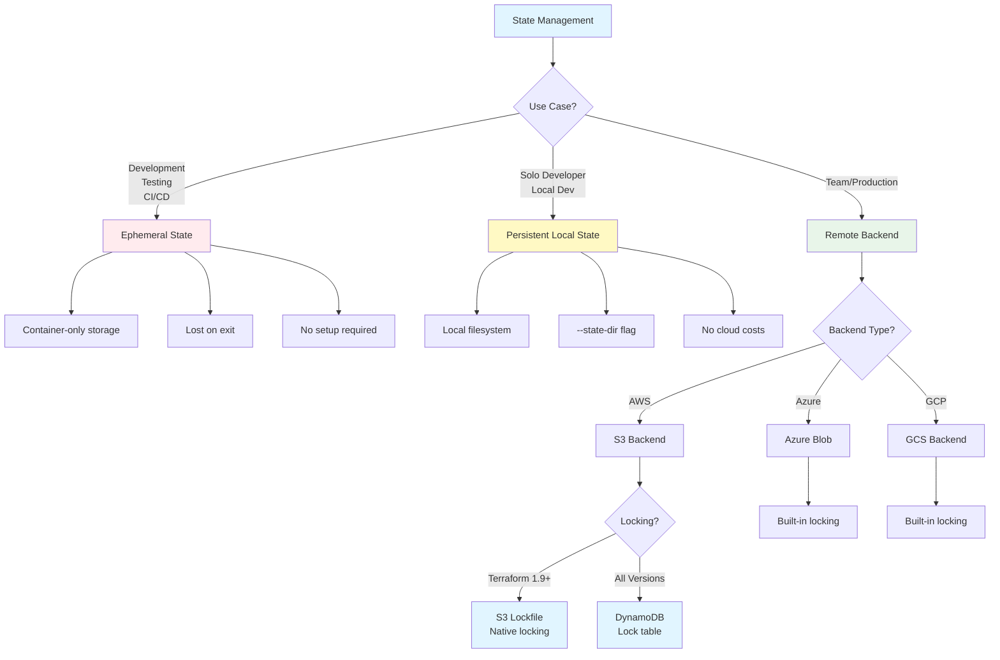
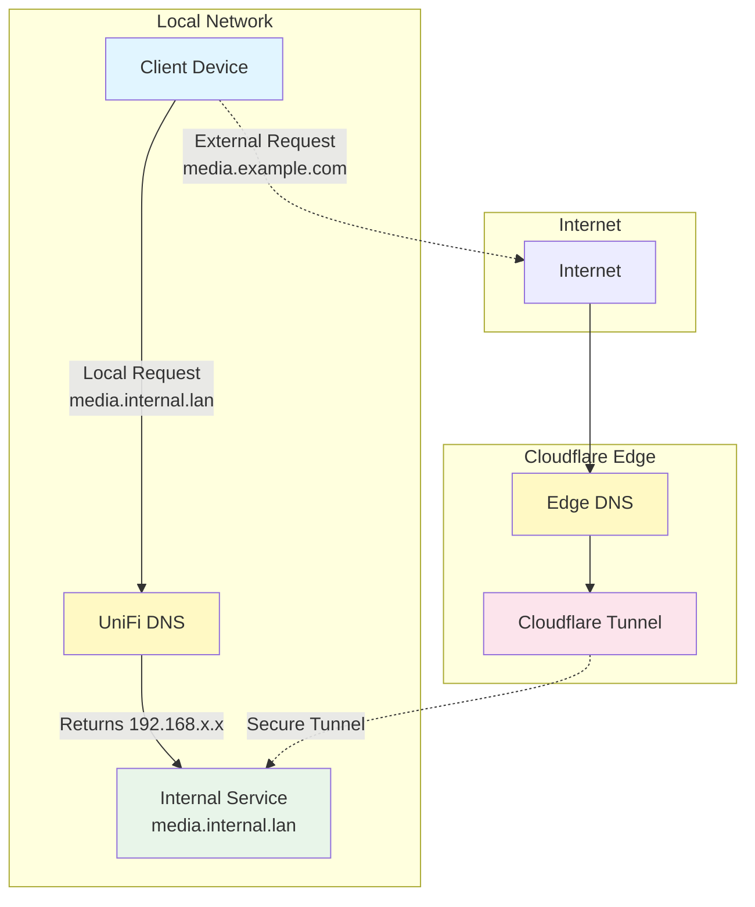

# Architecture

This document provides visual diagrams of the `unifi-cloudflare-glue` system architecture, data flow, deployment workflow, and DNS resolution paths. All diagrams use [Mermaid](https://mermaid.js.org/) syntax for native GitHub rendering.

## Table of Contents

- [System Architecture](#system-architecture)
- [Data Flow](#data-flow)
- [Deployment Workflow](#deployment-workflow)
- [State Management](#state-management)
- [DNS Resolution](#dns-resolution)

---

## System Architecture

The system is organized into four distinct layers, each responsible for a specific aspect of the infrastructure management pipeline.

### Layer Descriptions

| Layer | Components | Purpose |
|-------|------------|---------|
| **Configuration** | KCL schemas, user `main.k` | Define services once in a unified format |
| **Orchestration** | Dagger module, Terraform | Containerized pipeline for reproducible deployments |
| **Infrastructure** | UniFi Controller, Cloudflare API | Target APIs for DNS and tunnel management |
| **Network** | Local DNS, Tunnel, Edge DNS | Runtime name resolution and access paths |

---

## Data Flow

This diagram illustrates the complete transformation pipeline from KCL configuration through validation to infrastructure deployment.

### Flow Description

1. **Configuration**: User defines services in `main.k` using KCL schemas
2. **Validation**: KCL validates the configuration for correctness
3. **Error Path**: Invalid configurations must be fixed before proceeding
4. **JSON Generation**: Valid configurations generate provider-specific JSON
5. **Parallel Deployment**: UniFi and Cloudflare deployments happen sequentially
6. **Final State**: Both local DNS and remote access are established

---

## Deployment Workflow

The sequence diagram shows the step-by-step interaction between components during a deployment.

### Phase Breakdown

| Phase | Provider | Resources Created | Dependencies |
|-------|----------|-------------------|--------------|
| **Phase 1** | UniFi | DNS A records for local resolution | None |
| **Phase 2** | Cloudflare | Tunnel, Edge DNS records, Config | UniFi DNS (for local_service_url validation) |

---

## State Management

The decision tree helps you choose the appropriate state management strategy based on your use case.

### State Management Options

| Option | Persistence | Setup | Best For |
|--------|-------------|-------|----------|
| **Ephemeral** | Container only | None | Quick tests, CI/CD |
| **Persistent Local** | Host filesystem | `--state-dir` flag | Solo development |
| **Remote Backend** | Cloud storage | Backend config file | Team environments, production |

### S3 Locking Compatibility

| Method | Terraform Version | Notes |
|--------|-------------------|-------|
| S3 Lockfile | 1.9+ | Native S3 locking, no extra resources |
| DynamoDB | All versions | Requires DynamoDB table for locking |

---

## DNS Resolution

This diagram shows how DNS resolution differs for local network access versus external access.

### Resolution Paths

| Path | Domain Example | Flow | Use Case |
|------|----------------|------|----------|
| **Local** | `media.internal.lan` | Client → UniFi DNS → Service | Home network access |
| **External** | `media.example.com` | Client → Internet → Edge DNS → Tunnel → Service | Remote access |

### Security Note

The tunnel connection (dotted line) represents an encrypted connection through Cloudflare's network, providing secure access to internal services without exposing them directly to the internet.

---

## Related Documentation

- [Getting Started](getting-started.md) - Installation and first deployment
- [State Management](state-management.md) - Detailed state backend configuration
- [Dagger Reference](dagger-reference.md) - Complete function reference
- [KCL Configuration Guide](kcl-guide.md) - Schema reference and examples
