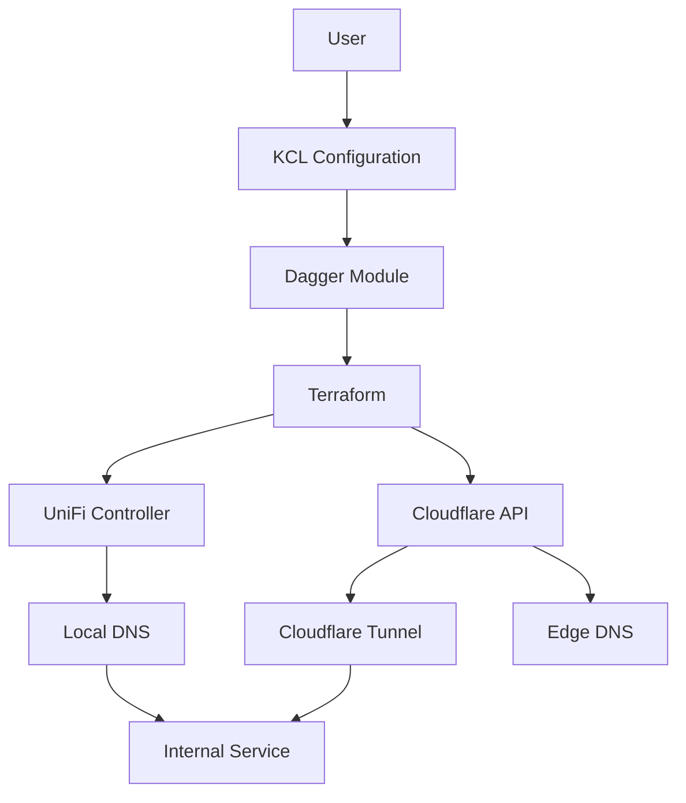
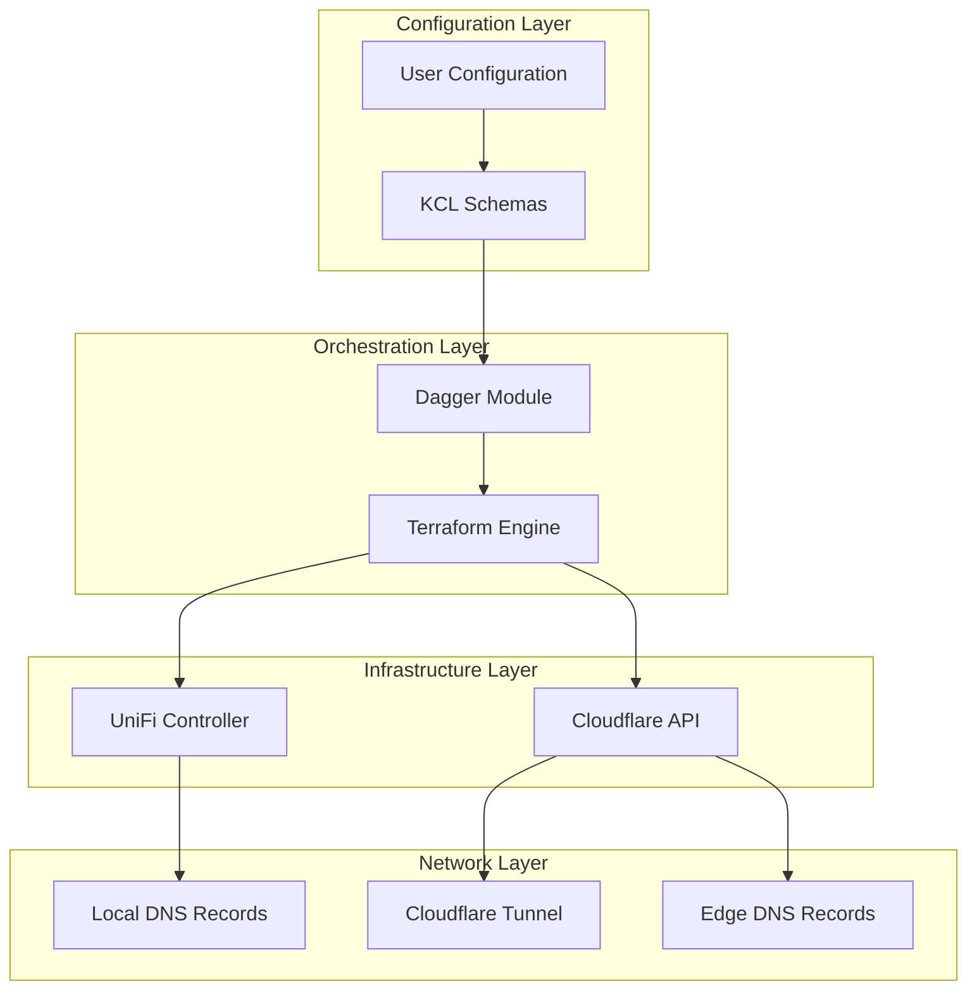
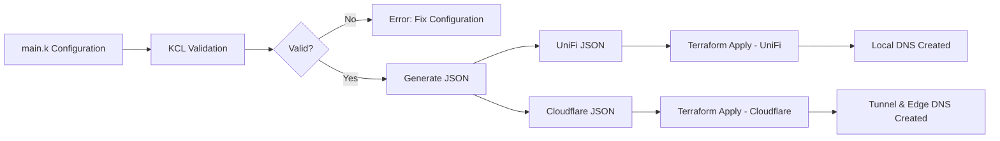
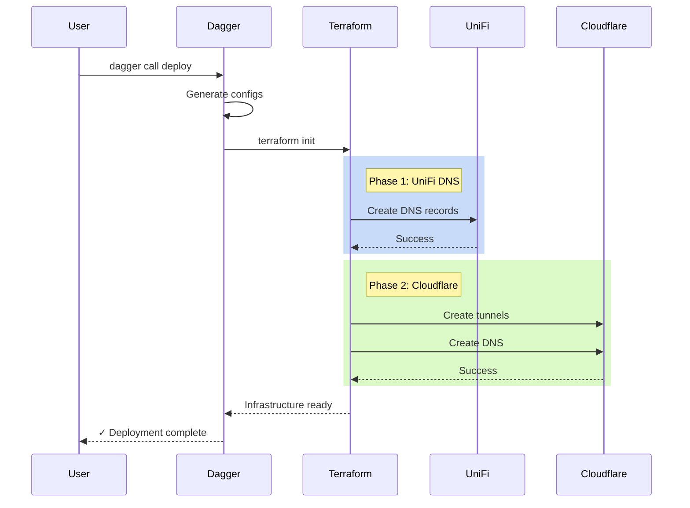
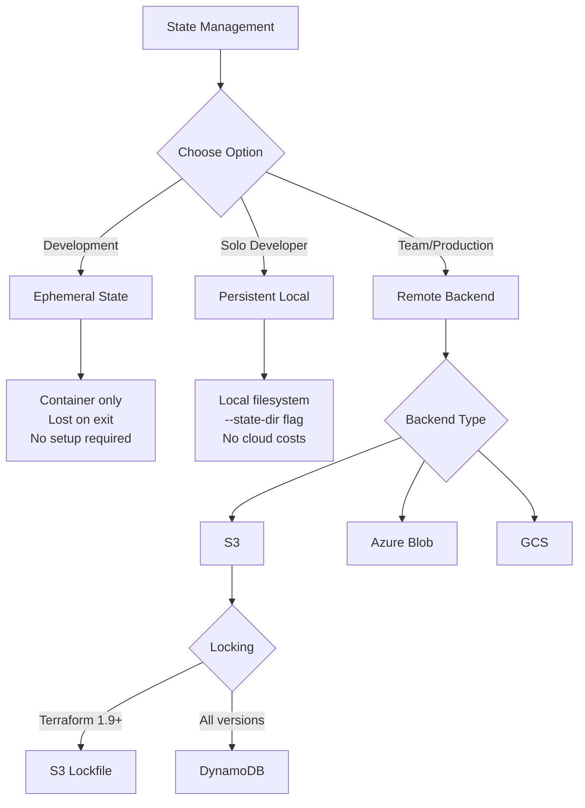
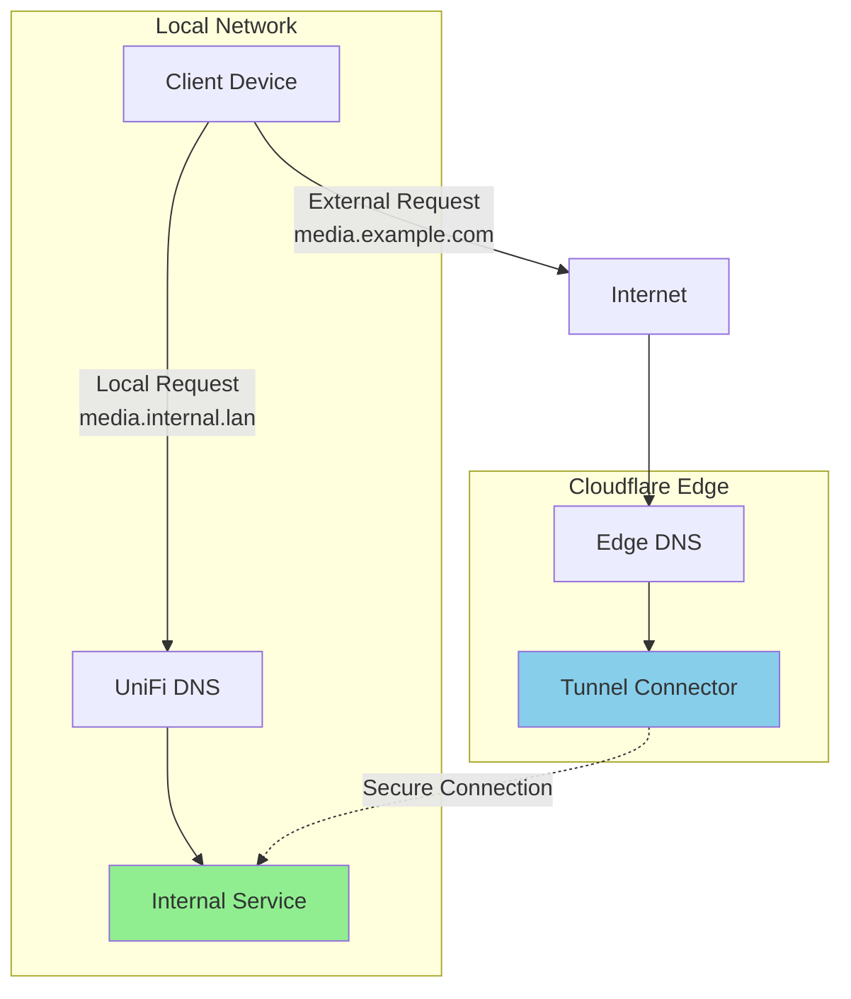

# OpenSpec Prompt: Architecture Diagrams

## Context

The documentation lacks visual representations of the system architecture, data flow, and component interactions, making it harder for users to understand how the pieces fit together.

## Goal

Create visual diagrams using Mermaid to illustrate system architecture, data flow, deployment workflows, and state management options.

## Scope

### In Scope

1. Create [`docs/architecture.md`](../../docs/architecture.md) with diagrams
2. Add Mermaid diagrams for:
   - System architecture (components and relationships)
   - Data flow (KCL → Dagger → Terraform → APIs)
   - Deployment workflow (steps and dependencies)
   - State management comparison
   - DNS resolution flow (local/remote)
3. Embed diagrams in appropriate documentation sections
4. Ensure diagrams render correctly in GitHub

### Out of Scope

- External diagram tools (PNG/SVG) - use Mermaid only
- UML diagrams beyond basic architecture
- Detailed sequence diagrams for every function
- Network topology diagrams

## Desired Behavior

### Documentation Structure: docs/architecture.md

```markdown
# Architecture Documentation

## System Architecture



## Data Flow

Shows KCL configuration transformation to infrastructure

## Deployment Workflow

Shows deploy/destroy orchestration steps

## State Management

Comparison of ephemeral/local/remote state

## DNS Resolution

How requests are routed locally vs remotely
```

### Diagram 1: System Architecture



### Diagram 2: Data Flow



### Diagram 3: Deployment Workflow



### Diagram 4: State Management Options



### Diagram 5: DNS Resolution Flow



## Constraints & Assumptions

### Constraints

- Use Mermaid only (GitHub-native rendering)
- Keep diagrams simple and focused
- Ensure text is readable at normal zoom
- Test rendering in GitHub markdown preview

### Assumptions

- Users understand basic network concepts
- Visual learners benefit from diagrams
- Diagrams complement, not replace, text documentation
- GitHub renders Mermaid correctly

## Acceptance Criteria

- [ ] [`docs/architecture.md`](../../docs/architecture.md) created with comprehensive diagrams
- [ ] System architecture diagram shows all components
- [ ] Data flow diagram shows transformation pipeline
- [ ] Deployment workflow diagram shows step sequence
- [ ] State management diagram shows decision tree
- [ ] DNS resolution diagram shows local/remote paths
- [ ] All diagrams render correctly in GitHub
- [ ] Diagrams embedded in relevant documentation sections
- [ ] Links added from main README to architecture docs
- [ ] Diagrams use consistent styling and terminology

## Expected Files/Areas Touched

- `docs/architecture.md` (new)
- `docs/getting-started.md` (embed simplified architecture diagram)
- `docs/state-management.md` (embed state management diagram)
- `docs/README.md` (update index)
- `README.md` (add architecture diagram, link to full docs)

## Dependencies

- Prompt 01 (docs structure must exist)
- Prompt 03 (state management docs for context)

## Notes

- Mermaid is natively supported by GitHub, no external tools needed
- Keep diagrams simple - complex diagrams are hard to maintain
- Use consistent terminology from documentation
- Consider colorblind-friendly colors
- Test rendering on both light and dark GitHub themes
